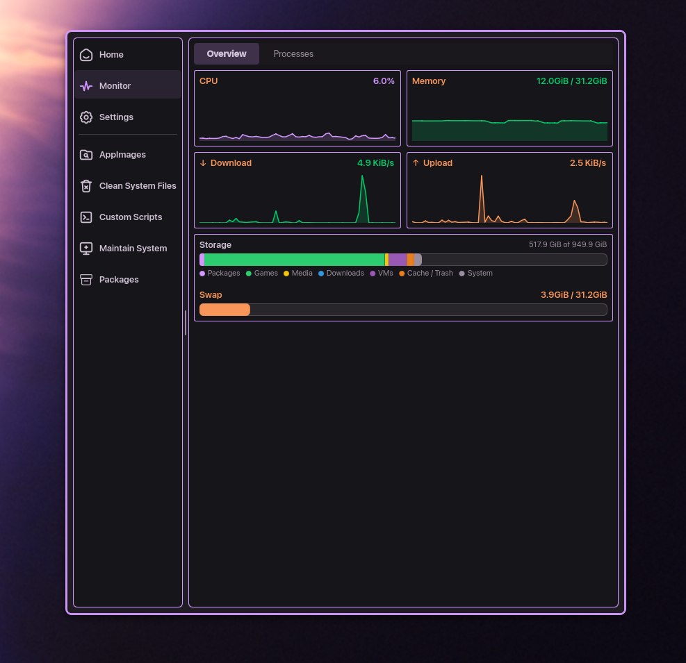
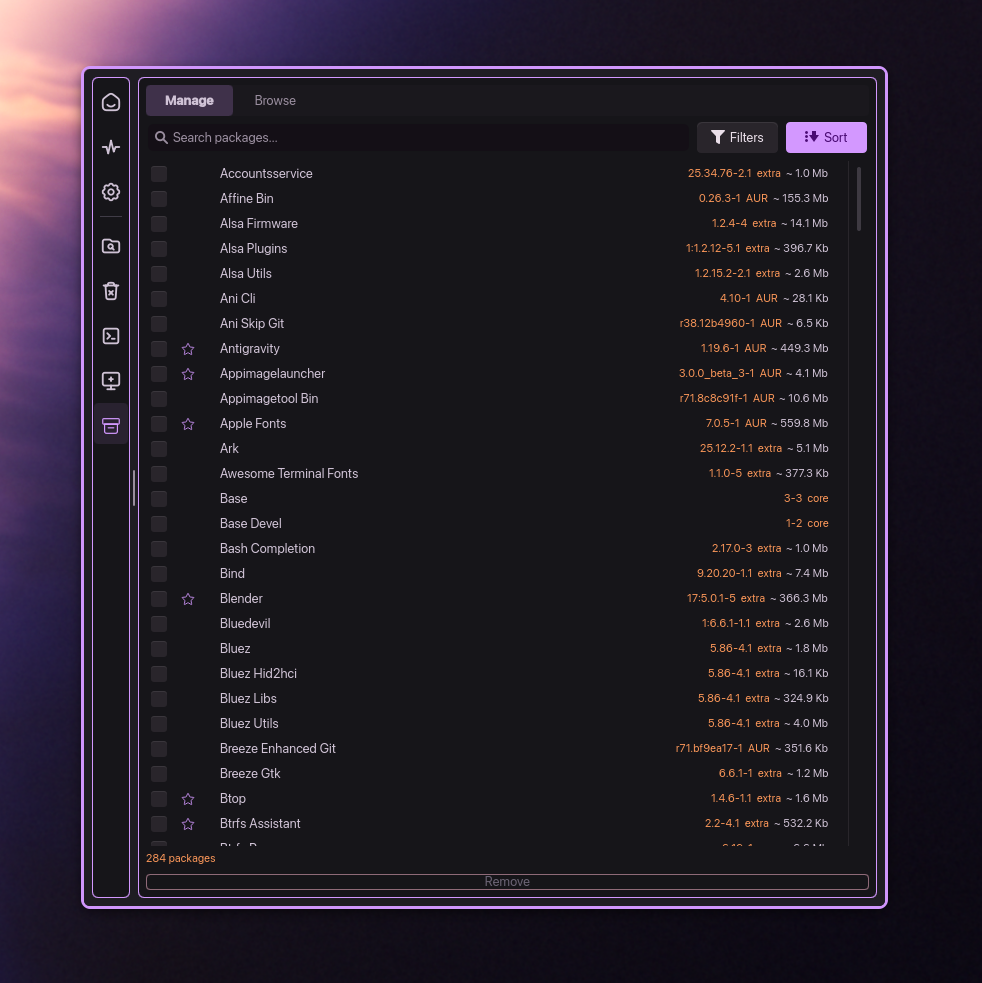
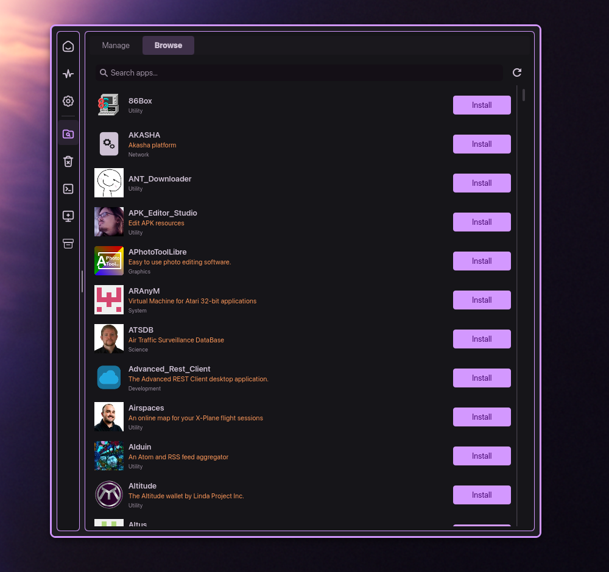

# Maintainer
## AI Disclaimer

**Disclaimer**: Artificial Intelligence (AI) was utilized in the creation, coding, and design of this project.

**Maintainer** is a system maintenance utility for Linux, specifically designed to integrate with the KDE Plasma desktop environment. "Built" using Python, PyQt6, and the Kirigami UI framework, it provides a powerful yet intuitive interface for keeping your system clean, updated, and in good condition.
## Screenshots

<details>
<summary>Click to expand screenshots</summary>





</details>

## Features

- 🚀 **System Health Dashboard**: Accurate, real-time metrics for CPU, Memory, Network traffic, Swap usage, and detailed Storage distribution.
- 📦 **Native Package Manager**: Comprehensive interface for Arch Linux package management, supporting popular AUR helpers like `paru` and `yay`.
- 🎁 **AppImage Hub**: A centralized manager to browse, download, launch, and update AppImages with integrated version tracking and GitHub release checking.
- 🧹 **Corpse Cleaner**: Intelligent identification and deep scanning for orphaned configuration files, cache directories, and system "dead weight" from uninstalled software.
- 🗑️ **Clean System Files**: Safely remove standard package caches, clear old system logs, and purge orphaned dependencies to reclaim valuable disk space.
- 📜 **Custom Scripts**: Execute your own custom bash scripts safely through a GUI, complete with live terminal output.
- 🔐 **EFI Boot Audit**: Advanced low-level tooling to audit and manage EFI boot entries.
- 🖌️ **Native Desktop Integration**: Perfect alignment with KDE Plasma's UI guidelines, matching global corner radius, colors, UI elements. Tested with [KDE Material You Colors](https://github.com/luisbocanegra/kde-material-you-colors) . 

## Architecture

Maintainer is built with a strictly decoupled architecture:
- **Backend**: Python 3 code leveraging `PyQt6` for logic and system integration.
- **Frontend**: Responsive, modern UI implemented in `QML` using the `Kirigami` framework.
- **Design System**: Centralized JSON-based configuration for colors, icons, and typography.

## Getting Started

### Prerequisites

Ensure you have the following system dependencies installed:
- Python 3.10+
- PyQt6
- KDE Kirigami
- Kirigami Addons

### Running from Source

1. Clone the repository:
   ```bash
   git clone https://github.com/strandzen/Maintainer.git
   cd Maintainer
   ```
2. Install Python dependencies:
   ```bash
   pip install -r requirements.txt # If available, or pip install PyQt6 psutil
   ```
3. Launch the application:
   ```bash
   python main.py
   ```

## Building a Standalone Binary

Maintainer can be bundled into a single standalone executable using PyInstaller.

1. Run the included build script:
   ```bash
   chmod +x build_binary.sh
   ./build_binary.sh
   ```
2. The bundled binary will be located at `dist/Maintainer`.

## Credits & Acknowledgements

- **Icons**: Sourced from [Dazzle UI](https://dazzleui.com/).
- **AppImages**: Sourced from the [AppImageHub GitHub repository](https://github.com/AppImage/appimage.github.io).


## License

This project is licensed under the MIT License - see the LICENSE file for details.
